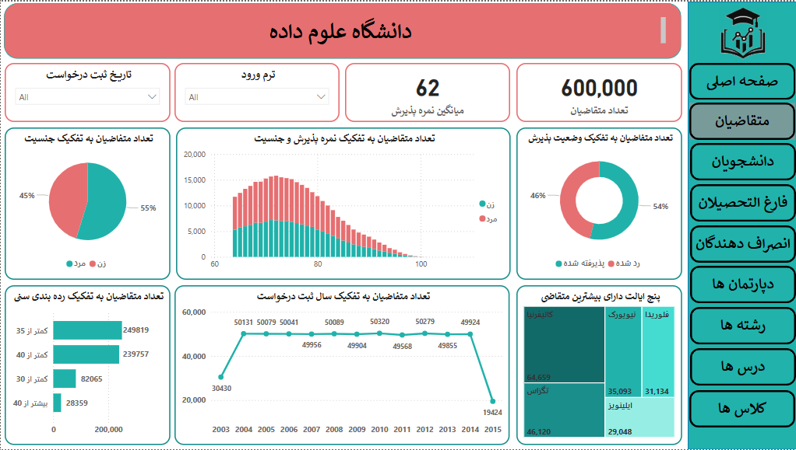

# 🎓 Students Analytics Dashboard – Power BI

An interactive Power BI dashboard analyzing student-related data, including applicants, students, graduates, dropouts, departments, classes, and courses.

This dashboard was developed as the final project for a Power BI training course, with multi-page reporting and visual exploration of performance indicators across the student lifecycle.

---

## 📊 Dashboard Pages & Highlights

### 📍 Applicants
- Over 600,000 records analyzed
- Gender breakdown of applicants
- Admission status (Accepted / Rejected)
- Admission score comparison by gender
- Application trends by year and state

### 📍 Students
- Over 119,000 currently or previously enrolled students
- Status: Enrolled / Graduated / Dropped out
- Distribution by gender, grade level, major and geography

### 📍 Graduates
- Graduation trends across years
- Gender and major breakdown
- Top states for graduate concentration

### 📍 Dropouts
- Dropout rate analysis by gender and major
- Academic level and age distributions

### 📍 Departments & Courses
- 11 departments and 20 programs
- Number of class sessions by course and department
- Grade distribution: A / B / C / D

---

## 🛠 Tools & Technologies

- Power BI Desktop
- Power Query (M Language)
- Star schema data modeling
- Excel & SQL Server as data sources
- Visuals: KPI cards, bar charts, pie charts, treemaps, tables

---

## 📦 Downloads

You can download the full Power BI report and SQL backup here:

➡️ **[Download Dashboard & Backup from Release](https://github.com/SamiraSiavash/students-dashboard/releases/latest)**

Files included:
- `students-dashboard.pbix`
- `students_Full.zip`

---

## 📸 Dashboard Screenshots

📁 See `/images/` folder for preview screenshots.  
Here's an example from the "Applicants" page:

---

## 👩‍💻 Author

**Samira Siavash**  
[🌐 LinkedIn](https://linkedin.com/in/samira-siavash) | [💻 GitHub](https://github.com/SamiraSiavash)

---

## 📜 License

This project is licensed under the MIT License – see the [LICENSE](LICENSE) file for details.
